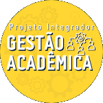

<!-- Adicione Badges das tecnologias que você usou aqui -->
<!-- Você pode encontrar badges aqui: https://github.com/Ileriayo/markdown-badges?tab=readme-ov-file#markdown-badges -->

**Este projeto foi desenvolvido como atividade final do curso de capacitação em Python da Cyber Edux, realizado de setembro de 2023 até março de 2024. Para mais informações, consulte o [enunciado](ENUNCIADO.md).**

# Projeto Integrador

<!-- Substitua a seguinte imagem por uma logo do seu projeto -->

<!-- Substitua o seguinte parágrafo por um resumo do seu projeto: -->
O Projeto consiste em um site de gestão acadêmica. Ao fazer login, serão exibidas as disciplinas registradas juntamente com o nome do professor responsável. Ao clicar em "Acessar Disciplina", os alunos matriculados nela serão exibidos. Apenas usuários cadastrados como professores têm permissão para adicionar disciplinas novas e atribuir alunos a elas.
## Documentação

* [Documentação (para desenvolvedores)](DOCUMENTACAO.md)
* [Manual (para usuários)](MANUAL.md)

## Sobre o autor

<!-- Coloque seu nome, uma foto sua e uma pequena bio sobre você na seguinte tabela: -->
|  |  |
|:-------------:|:------------------------------------------------------------:|
|    **Alexandre César** | Meu nome é Alexandre César, tenho 17 anos e estou cursando o último ano do curso técnico em Eletrotécnica no IFMT. |
